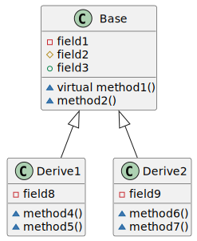

# cppcheats

> 工作中常用的库

| 库                                                       | 使用到的功能       |
|---------------------------------------------------------|--------------|
| [folly](https://github.com/facebook/folly)              | 线程池/异步任务封装   |
| [rapidjson](https://github.com/Tencent/rapidjson)       | json解析/生成    |
| [protobuf](https://github.com/protocolbuffers/protobuf) | protobuf读写   |
| [zstd](https://github.com/facebook/zstd)                | 压缩           |
| [snappy](https://github.com/google/snappy)              | 压缩           |
| [zlib](https://github.com/madler/zlib)                  | 压缩           |
| [fmt](https://github.com/fmtlib/fmt)                    | format       |
| [cpr](https://github.com/libcpr/cpr)                    | http request |
| [thrift](https://github.com/apache/thrift)              | rpc协议        |
| [tbb](https://github.com/oneapi-src/oneTBB)             | 线程安全的容器      |
| [openmp](https://www.openmp.org/)                       | 并行计算         |
| [Log4cxx](https://github.com/apache/logging-log4cxx)    | 日志           |
| [jemalloc](https://github.com/jemalloc/jemalloc)        | 内存分配         |
| [cityhash](https://github.com/google/cityhash)          | hash         |

- [cppcheats](#cppcheats)
- [folly](#folly)
    - [线程池](#线程池)
    - [异步封装](#异步封装)
    - [执行多个异步任务](#执行多个异步任务)
    - [类型转换](#类型转换)
- [rapidjson](#rapidjson)
    - [parse json](#parse-json)
    - [generate json](#generate-json)
- [openmp](#openmp)
- [protobuf](#protobuf)
    - [数据类型](#数据类型)
    - [序列化](#序列化)
    - [反序列化](#反序列化)
    - [`arean`](#arean)
    - [json convert](#json-convert)
    - [反射](#反射)
    - [编码规则](#编码规则)
- [thrift](#thrift)
    - [数据类型](#数据类型-1)
    - [序列化/反序列化](#序列化反序列化)
    - [编码规则](#编码规则-1)
- [压缩与解压](#压缩与解压)
    - [zstd](#zstd)
        - [压缩](#压缩)
        - [解压](#解压)
    - [snappy](#snappy)
        - [压缩](#压缩-1)
        - [解压](#解压-1)
    - [zlib](#zlib)
        - [压缩](#压缩-2)
        - [解压](#解压-2)
- [tbb](#tbb)
    - [线程安全的容器](#线程安全的容器)
    - [并行算法](#并行算法)
    - [并行循环](#并行循环)
- [`static` 变量初始化](#static-变量初始化)
    - [`before c17`](#before-c17)
    - [`after c17`](#after-c17)
- [`struct binding`](#struct-binding)
- [`cast`](#cast)
    - [`const_cast`](#const_cast)
    - [`static_cast`](#static_cast)
    - [`dynamic_cast`](#dynamic_cast)
    - [`reinterpret_cast`](#reinterpret_cast)

# folly

## 线程池

```c++
std::shared_ptr<folly::CPUThreadPoolExecutor> thread_pool() {
    static auto pool = create(10, "global_exec", true);
    return pool;
}

std::shared_ptr<folly::CPUThreadPoolExecutor> create(size_t thread_num, std::string_view prefix, bool block) {
    using Executor = folly::CPUThreadPoolExecutor;
    using BQueue = folly::LifoSemMPMCQueue<folly::CPUThreadPoolExecutor::CPUTask, folly::QueueBehaviorIfFull::BLOCK>;
    using TQueue = folly::LifoSemMPMCQueue<folly::CPUThreadPoolExecutor::CPUTask, folly::QueueBehaviorIfFull::THROW>;
    size_t size = folly::CPUThreadPoolExecutor::kDefaultMaxQueueSize;
    auto factory = std::make_shared<folly::NamedThreadFactory>(prefix);

    std::shared_ptr<Executor> pool;

    if (block) {
        pool = std::make_shared<Executor>(thread_num, std::make_unique<BQueue>(size), factory);
    } else {
        pool = std::make_shared<Executor>(thread_num, std::make_unique<TQueue>(size), factory);
    }

    LOG(INFO) << "ResourceManager create " << prefix << " size " << thread_num << " block " << block;

    return pool;
}
```

## 异步封装

```c++
int get(const std::string & url, std::string & response) {
    cpr::Response resp = cpr::Get(cpr::Url{url});
    response = resp.text;
    return resp.status_code;
}

folly::Future<int> async_get(const std::string & url, std::string & response) {
    return folly::via(thread_pool().get(), [&]() { return get(url, response); });
}
```

## 执行多个异步任务

```c++
folly::Future<int> batch_get(const std::vector<std::string> & urls, std::vector<std::string> & resps) {
    std::vector<folly::Future<int>> fts;
    fts.reserve(urls.size());

    resps.clear();
    resps.resize(urls.size());

    for (int i = 0; i < urls.size(); i++) {
        fts.push_back(folly::via(thread_pool().get(), [i, &urls, &resps]() { return get(urls[i], resps[i]); }));
    }
    return folly::collectAll(fts).via(folly::getGlobalCPUExecutor().get()).then([](const folly::Try<std::vector<folly::Try<int>>> & vals) {
        if (vals.hasException()) {
            LOG(ERROR) << "exception:" << vals.exception().what();
            return -1;
        }

        for (const auto & item : vals.value()) {
            if (item.hasValue()) {
                LOG(INFO) << "status code:" << item.value();
            }
        }

        return 0;
    });
}
```

## 类型转换

```c++

int convert(std::string_view str, int defval) {
    return folly::tryTo<int>(str).value_or(defval);
}

std::string hw = folly::to<std::string>("hello", "world");
ASSERT_EQ(hw, "helloworld");

```

# rapidjson

## parse json

```c++
bool parse_json_to_map(const std::string & src, std::unordered_map<std::string, std::string> & dst) {
    rapidjson::Document doc;
    doc.Parse(src.c_str());

    if (doc.HasParseError()) {
        LOG(ERROR) << "parse fail,error:" << doc.GetParseError();
        return false;
    }

    if (!doc.IsObject()) {
        return false;
    }

    for (const auto & elem : doc.GetObject()) {
        if (elem.value.IsString()) {
            dst.insert(std::make_pair(elem.name.GetString(), elem.value.GetString()));
        }
    }
    return !dst.empty();
}
```

## generate json

```c++
bool generate_json(std::string & dst) {
    rapidjson::Document doc;
    doc.SetObject();

    rapidjson::Document::AllocatorType & allocator = doc.GetAllocator();

    rapidjson::Value array(rapidjson::kArrayType);

    rapidjson::Value hello_value(rapidjson::kStringType);
    hello_value.SetString("hello");

    rapidjson::Value world_value(rapidjson::kStringType);
    world_value.SetString("world");

    array.PushBack(hello_value, allocator);
    array.PushBack(world_value, allocator);
    doc.AddMember("array", array, allocator);

    rapidjson::Value person(rapidjson::kObjectType);
    person.AddMember("age", 20, allocator);

    rapidjson::Value email_value(rapidjson::kStringType);
    email_value.SetString("test@test.com");
    person.AddMember("email", email_value, allocator);
    doc.AddMember("person", person, allocator);

    doc.AddMember("data_size", 1, allocator);

    rapidjson::StringBuffer buf;
    rapidjson::Writer<rapidjson::StringBuffer> writer(buf);

    doc.Accept(writer);

    dst = buf.GetString();

    return true;
}
```

# openmp

# protobuf

```shell
vcpkg install protobuf
```

## 数据类型

```protobuf
syntax = "proto3";

package tutorial;

option cc_generic_services = true;


enum PhoneType {MOBILE = 0;
	HOME = 1;
	WORK = 2;}

message PhoneNumber {string number = 1;
	PhoneType pt = 2;}

enum Gender {UNKNOWN = 0;
	MALE = 1;
	FEMALE = 2;}

enum Role {CIVILIAN = 0;
	SOLDIER = 1;}

message Person {int32 id = 1;
	string name = 2;
	string email = 3;
	uint32 age = 4;
	repeated PhoneNumber numbers = 5;
	Gender gender = 6;
	Role role = 7;
	map<string, string> extras = 100;}
```

## 序列化

```c++

void message_to_string(const tutorial::Person & person, std::string & dst) {
    if (bool status = person.SerializeToString(&dst); !status) {
        LOG(ERROR) << "marshal fail";
    }
}

TEST(prototest, messagetostring) {
    auto person = std::make_shared<tutorial::Person>();

    person->set_id(1024);
    person->set_age(20);
    person->set_name("tom");
    person->set_gender(tutorial::Gender::MALE);
    person->set_role(tutorial::Role::SOLDIER);
    auto * num = person->mutable_numbers();

    tutorial::PhoneNumber work;
    work.set_number("139-999-9999");
    work.set_pt(tutorial::PhoneType::WORK);
    num->Add(std::move(work));

    tutorial::PhoneNumber mobile;
    mobile.set_number("139-999-8888");
    mobile.set_pt(tutorial::PhoneType::MOBILE);
    num->Add(std::move(mobile));

    auto * extra = person->mutable_extras();
    (*extra)["hello"] = "world";
    (*extra)["hello1"] = "world1";
    (*extra)["hello2"] = "world2";

    std::string rsp;

    prototest::message_to_string(*person, rsp);

    std::stringstream ss;
    ss.str("");

    Poco::Base64Encoder encoder(ss);
    encoder << rsp;
    encoder.close();

    LOG(INFO) << "rsp:" << rsp << "|";

    std::string str = ss.str();

    LOG(INFO) << "rsp:" << rsp << "|";
    LOG(INFO) << "str:" << str << "|";

    ASSERT_EQ(3, person->extras().size());
    ASSERT_GT(str.size(), 0);
}
```

## 反序列化

```c++
void string_to_message(const std::string & src, tutorial::Person & dst) {
    if (bool status = dst.ParseFromString(src); !status) {
        LOG(ERROR) << "unmarshal fail";
    }
}

TEST(prototest, stringtomessage) {
    auto person = std::make_shared<tutorial::Person>();

    person->set_id(1024);
    person->set_age(20);
    person->set_name("tom");
    person->set_gender(tutorial::Gender::MALE);
    person->set_role(tutorial::Role::SOLDIER);
    auto * num = person->mutable_numbers();

    tutorial::PhoneNumber work;
    work.set_number("139-999-9999");
    work.set_pt(tutorial::PhoneType::WORK);
    num->Add(std::move(work));

    tutorial::PhoneNumber mobile;
    mobile.set_number("139-999-8888");
    mobile.set_pt(tutorial::PhoneType::MOBILE);
    num->Add(std::move(mobile));

    auto * extra = person->mutable_extras();
    (*extra)["hello"] = "world";
    (*extra)["hello1"] = "world1";
    (*extra)["hello2"] = "world2";

    std::string str;
    prototest::message_to_string(*person, str);

    auto person2 = std::make_shared<tutorial::Person>();

    prototest::string_to_message(str, *person2);

    LOG(INFO) << "extra:" << person2->extras_size();
    ASSERT_EQ(person2->name(), "tom");
    ASSERT_EQ(person2->extras_size(), 3);
}
```

## `arean`

```protobuf
// proto 文件增加option
option  cc_enable_arenas = true;
```

```c++
TEST(prototest, createarean) {
    google::protobuf::ArenaOptions opt;
    opt.initial_block_size = 1024 * 16;
    google::protobuf::Arena arena(opt);

    tutorial::Person * person = google::protobuf::Arena::CreateMessage<tutorial::Person>(&arena);

    person->set_age(20);
    person->set_id(1024);
    person->set_name("jerry");

    auto * extra = person->mutable_extras();
    (*extra)["hello"] = "world";
    (*extra)["hello1"] = "world1";
    (*extra)["hello2"] = "world2";

    LOG(INFO) << "person:" << person->DebugString();
}
```

## json convert

```c++
void message_to_json(const tutorial::Person & person, std::string & dst) {
    google::protobuf::util::JsonOptions opt;

    opt.preserve_proto_field_names = true;
    google::protobuf::util::Status status = google::protobuf::util::MessageToJsonString(person, &dst, opt);

    if (!status.ok()) {
        LOG(INFO) << "convert message to json fail." << status.message();
    }
}

void json_to_message(const std::string & src, tutorial::Person & dst) {
    google::protobuf::util::JsonParseOptions opt;

    opt.ignore_unknown_fields = true;

    google::protobuf::util::Status status = google::protobuf::util::JsonStringToMessage(src, &dst, opt);
    if (!status.ok()) {
        LOG(INFO) << "convert json to message fail." << status.message();
    }
}
```

## 反射

## 编码规则

[编码规则](https://github.com/halfrost/Halfrost-Field/blob/master/contents/Protocol/Protocol-buffers-encode.md#%E5%85%AD-protocol-buffer-%E7%BC%96%E7%A0%81%E5%8E%9F%E7%90%86)

# thrift

## 数据类型

## 序列化/反序列化

## 编码规则

# 压缩与解压

```c++
enum class Type : uint32_t {
    UNKNOWN = 0,
    ZSTD = 1,
    SNAPPY = 2,
    DEFLATE = 3, // RFC 1951
    ZLIB = 4, // RFC 1950
    GZIP = 5, // RFC 1952  https://pkg.go.dev/compress/gzip
};

constexpr int WB_DEFLATE = -MAX_WBITS;
constexpr int WB_ZLIB = MAX_WBITS;
constexpr int WB_GZIP = MAX_WBITS | 16;

constexpr int buf_size = 16 * 1024;

constexpr int DEFAULT_LEVEL = 5;

struct CompressOptions {
    const Type type;
    const int level; // ignore by snappy

    explicit CompressOptions(Type type, int level = DEFAULT_LEVEL);
};

bool Compressor::compress(const std::string & src, std::string & dst, const CompressOptions & ops) {
    switch (ops.type) {
        case Type::ZSTD:
            return zstd_compress(src, dst, ops.level);
        case Type::SNAPPY:
            return snappy_compress(src, dst);
        case Type::DEFLATE:
            return zlib_compress(src, dst, WB_DEFLATE, ops.level);
        case Type::ZLIB:
            return zlib_compress(src, dst, WB_ZLIB, ops.level);
        case Type::GZIP:
            return zlib_compress(src, dst, WB_GZIP, ops.level);
        case Type::UNKNOWN:
            break;
    }
    LOG(ERROR) << "unsupport compresss type." << static_cast<uint32_t>(ops.type);
    return false;
}

bool Compressor::decompress(const std::string & src, std::string & dst, const CompressOptions & ops) {
    switch (ops.type) {
        case Type::ZSTD:
            return zstd_decompress(src, dst);
        case Type::SNAPPY:
            return snappy_decompress(src, dst);
        case Type::DEFLATE:
            return zlib_decompress(src, dst, WB_DEFLATE);
        case Type::ZLIB:
            return zlib_decompress(src, dst, WB_ZLIB);
        case Type::GZIP:
            return zlib_decompress(src, dst, WB_GZIP);
        case Type::UNKNOWN:
            break;
    }

    LOG(ERROR) << "unsupport decompress type." << static_cast<uint32_t>(ops.type);
    return false;
}
```

## zstd

### 压缩

```c++
bool Compressor::zstd_compress(const std::string & src, std::string & dst, int level) {
    size_t bsize = ZSTD_compressBound(src.size());
    dst.resize(bsize);

    auto * dstp = const_cast<void *>(static_cast<const void *>(dst.c_str()));
    const auto * srcp = static_cast<const void *>(src.c_str());

    size_t size = ZSTD_compress(dstp, bsize, srcp, src.size(), level);

    if (auto code = ZSTD_isError(size); code) {
        return false;
    }
    dst.resize(size);
    return true;
}
```

### 解压

```c++
bool Compressor::zstd_decompress(const std::string & src, std::string & dst) {
    size_t bsize = ZSTD_getFrameContentSize(src.c_str(), src.size());

    if (0 == bsize) {
        return bsize;
    }

    if (ZSTD_CONTENTSIZE_ERROR == bsize) {
        return false;
    }

    dst.resize(bsize);
    auto * dstp = const_cast<void *>(static_cast<const void *>(dst.c_str()));
    const auto * srcp = static_cast<const void *>(src.c_str());
    size_t const size = ZSTD_decompress(dstp, bsize, srcp, src.size());
    if (auto code = ZSTD_isError(size); code) {
        return false;
    }
    dst.resize(size);
    return true;
}
```

## snappy

### 压缩

```c++
bool Compressor::snappy_compress(const std::string & src, std::string & dst) {
    size_t size = snappy::Compress(src.data(), src.size(), &dst);
    return size > 0;
}
```

### 解压

```c++
bool Compressor::snappy_decompress(const std::string & src, std::string & dst) {
    return snappy::Uncompress(src.data(), src.size(), &dst);
}
```

## zlib

### 压缩

```c++
bool Compressor::zlib_compress(const std::string & src, std::string & dst, int wb, int level) {
    z_stream zs;
    memset(&zs, 0, sizeof(zs));

    if (int status = deflateInit2(&zs, level, Z_DEFLATED, wb, MAX_MEM_LEVEL, Z_DEFAULT_STRATEGY); status != Z_OK) {
        LOG(ERROR) << "deflateInit failed. status:" << status;
        return false;
    }

    zs.next_in = (Bytef *)src.data();
    zs.avail_in = src.size(); // set the z_stream's input

    int ret;
    char outbuffer[buf_size];
    std::string outstring;

    // retrieve the compressed bytes blockwise
    do {
        zs.next_out = reinterpret_cast<Bytef *>(outbuffer);
        zs.avail_out = sizeof(outbuffer);

        ret = deflate(&zs, Z_FINISH);

        if (dst.size() < zs.total_out) {
            dst.append(outbuffer, zs.total_out - outstring.size());
        }
    } while (ret == Z_OK);

    deflateEnd(&zs);

    if (ret != Z_STREAM_END) {
        LOG(ERROR) << "compress fail. code:" << ret << " error:" << zs.msg;
        return false;
    }

    return true;
}
```

### 解压

```c++
bool Compressor::zlib_decompress(const std::string & src, std::string & dst, int wb) {
    z_stream zs;
    memset(&zs, 0, sizeof(zs));

    if (int status = inflateInit2(&zs, wb); status != Z_OK) {
        LOG(ERROR) << "inflateInit failed.status:" << status;
        return false;
    }

    zs.next_in = (Bytef *)src.data();
    zs.avail_in = src.size();

    int ret;
    char outbuffer[buf_size];

    do {
        zs.next_out = reinterpret_cast<Bytef *>(outbuffer);
        zs.avail_out = sizeof(outbuffer);

        ret = inflate(&zs, 0);

        if (dst.size() < zs.total_out) {
            dst.append(outbuffer, zs.total_out - dst.size());
        }
    } while (ret == Z_OK);

    inflateEnd(&zs);

    if (ret != Z_STREAM_END) {
        LOG(ERROR) << "compress fail. code:" << ret << " error:" << zs.msg;
        return false;
    }

    return true;
}
```

# tbb

> https://www.cnblogs.com/KillerAery/p/16333348.html#cpu-bound-%E4%B8%8E-memory-bound

## 线程安全的容器

## 并行算法

- map
- reduce
- filter
- scan

## 并行循环

# `static` 变量初始化

## `before c17`

```c++

// constant.h
class Constant {
public:
    static std::unordered_map<std::string, std::vector<std::string>> config1;
};

// constant.cpp

std::unordered_map<std::string, std::vector<std::string>> Constant::config1 = {
    {"3", {"1", "2", "3"}},
    {"4", {"4", "5", "6"}},
};

```

## `after c17`

```c++
class Constant {
public:
    static inline std::unordered_map<std::string, std::vector<std::string>> config2 = {
        {"1", {"1", "2", "3"}},
        {"2", {"4", "5", "6"}},
    };
};

```

# `struct binding`

```c++
struct Config {
    std::string v1;
    double v2;
};

TEST(testbinding, binding1) {
    double arr[3] = {1.0, 2.0, 3.0};
    auto [a, b, c] = arr;
    LOG(INFO) << "a " << a << " b " << b << " c " << c;

    std::array<std::string, 3> str_arr = {"ab", "cd", "ef"};
    auto [s1, s2, s3] = str_arr;
    LOG(INFO) << "s1 " << s1 << " s2 " << s2 << " s3 " << s3;
}

TEST(testbinding, binding2) {
    Config c{"world", 10.24};
    auto & [v1, v2] = c;
    LOG(INFO) << "v1 " << v1 << " v2 " << v2;
}

TEST(testbinding, binding3) {
    std::tuple<int, double, std::string> tp = std::make_tuple(1, 3.14, "hello world");

    // before c17
    int idx;
    double val;
    std::string str;
    std::tie(idx, val, str) = tp;
    LOG(INFO) << "idx " << idx << " val " << val << " str " << str;

    // after c17
    auto [v1, v2, v3] = tp;
    LOG(INFO) << "v1 " << v1 << " v2 " << v2 << " v3 " << v3;
}

TEST(testbinding, binding4) {
    std::pair<std::string, int64_t> p = std::make_pair("hello", 5);
    auto [k1, k2] = p;
    LOG(INFO) << "k1 " << k1 << " k2 " << k2;
}
```

# `cast`

| 类型                         | 说明                                             |
|----------------------------|------------------------------------------------|
| `const_cast`               | 用于去除或者增加变量的const属性                             |
| `static_cast`              | 静态地检查类型强制转换(编译期)                               |
| `dynamic_cast`             | 动态地检查类型强制转换(运行时)                               |
| `reinterpret_cast`         | 通过对底层字节数据进行重新解释来无条件的强制转换                       |
| `const_pointer_cast`       | `const_cast`的`std::shared_ptr`版本               |
| `static_pointer_cast`      | `static_pointer_cast`的`std::shared_ptr`版本      |
| `dynamic_pointer_cast`     | `dynamic_pointer_cast`的`std::shared_ptr`版本     |
| `reinterpret_pointer_cast` | `reinterpret_pointer_cast`的`std::shared_ptr`版本 |

## `const_cast`

> 给变量**增加**或者**移除** `const、volatile和__unaligned`属性

```c++
TEST(testcast, testconstcast) {
    const std::string str = "hello world";

    const char * c_str = str.c_str(); // c_str 是cost object

    char * no_const_str = const_cast<char *>(c_str);

    LOG(INFO) << "no_const_str:" << no_const_str;
}
```

## `static_cast`

> 没有运行时类型检查来保证安全性，**强制类型转换**所以安全期间，一般用于基本类型(int/double)等类型转换

- 用于类层次结构中基类（父类）和派生类（子类）之间指针或引用的转换
    - `upcast`（把派生类的指针或引用转换成基类表示）是安全的
    - `downcast`（把基类指针或引用转换成派生类表示）时，由于没有动态类型检查，所以是不安全的
- 用于基本数据类型之间的转换，如把int转换成char，把int转换成enum
- 把空指针转换成目标类型的空指针
- 把任何类型的表达式转换成void类型
- 无运行时转换开销
- 不能转换掉expression的const、volatile、或者__unaligned属性

```c++
TEST(testcast, teststaticcast) {
    int num = 1024;
    double num_d = static_cast<double>(num);
    LOG(INFO) << "num_d:" << num_d;

    // upcast
    Derived2 * d_ptr = new Derived2{};
    Base * b_ptr = static_cast<Base *>(d_ptr);
    LOG(INFO) << "b_ptr:" << b_ptr;

    // 失败
    //    Base * base_ptr = new Base{};
    //    Derived2 * d2_ptr = static_cast<Derived2 *>(base_ptr);
    //    LOG(INFO) << "d2_ptr:" << d2_ptr;
}
```

## `dynamic_cast`

> 用于多态场景中的类型转换.



- `upcast` 向上转换 `Derive1 -> Base` 成功且安全的
- `downcast` 向下转换  `Base -> Derive2` 可能失败
- `sideways` 同级别转换  `Derive1 -> Derive2` 要求有公共基类

```c++

// type-id 只能是类的指针、类的引用或者void *
// dynamic_cast <type-id> (expression) 
TEST(testcast, testdynamiccast) {
    Base b;
    Base * b_ptr;
    Derived d;
    Derived * d_ptr;
    b_ptr = dynamic_cast<Base *>(&d);
    b_ptr->run(); // 调用的是子类的方法

    // will fail
    d_ptr = dynamic_cast<Derived *>(&b);
    //    d_ptr->run();
}
```

## `reinterpret_cast`

> reinterpret_cast可以将任何指针类型转换为任何其他指针类型，甚至是不相关的类。 操作结果是从一个指针到另一个指针的值的简单二进制副本。
> 允许所有指针转换：既不检查指向的内容，也不检查指针类型本身。

```c++
TEST(testcast, testreinterpretcast) {
    Base * b_ptr1 = new Base();
    Derived1 * d1_ptr = new Derived1();
    Derived2 * d2_ptr = new Derived2();
    Base * b_ptr2 = new Base();

    d1_ptr = reinterpret_cast<Derived1 *>(b_ptr1);
    b_ptr2 = reinterpret_cast<Base *>(d2_ptr);

    LOG(INFO) << "d1_ptr:" << d1_ptr;
    LOG(INFO) << "d2_ptr:" << d2_ptr;

}
```